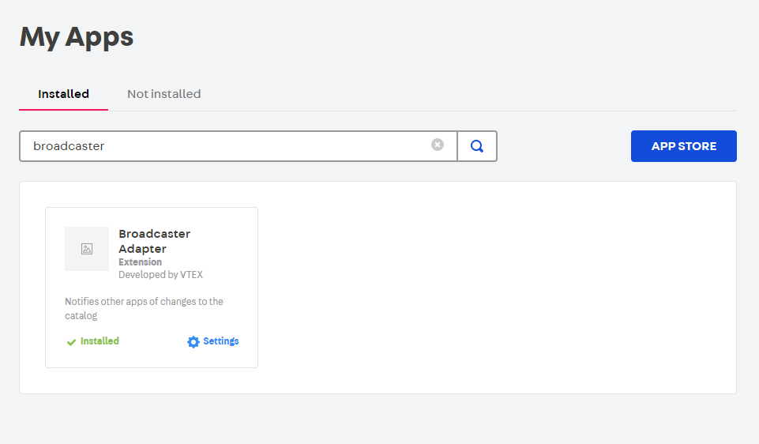

# Text link fixer

App in VTEX that receives a notification when a SKU is changed or created, if the Sku doesnt have Image this in going to be inactive

## How to install

⚠️ First, make sure the broadcaster app is installed.

Run command: `vtex install vtex.text-link-fixer`
